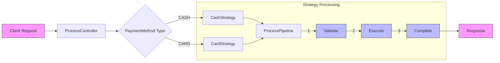
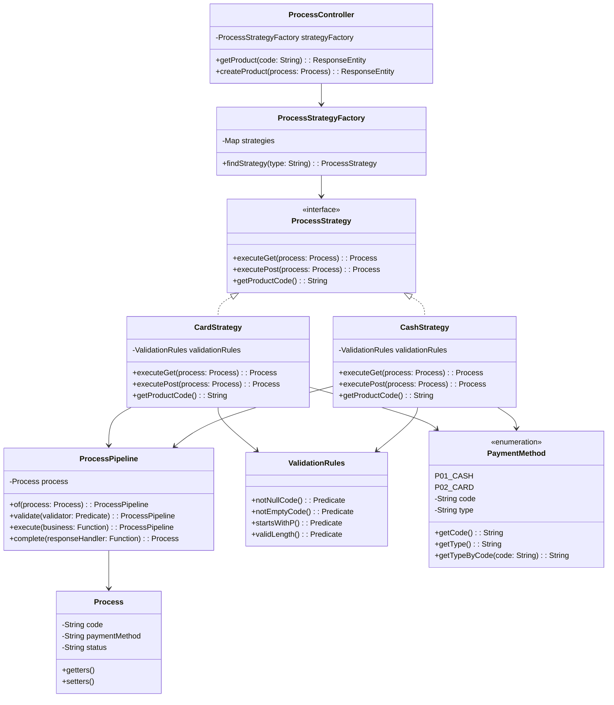
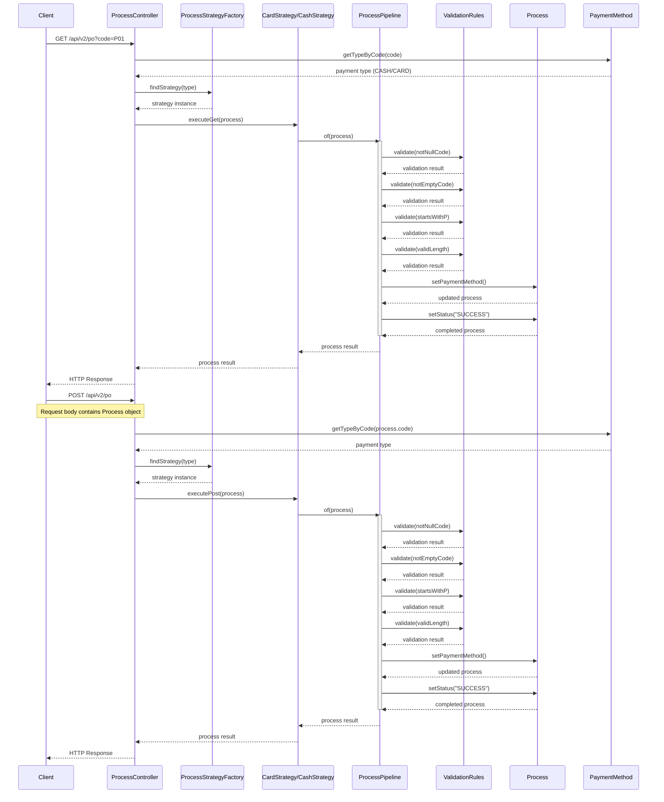

### Flow diagram

The flow diagram shows:
1. Client initiates request
2. ProcessController determines payment method
3. Appropriate strategy (Cash/Card) is selected
4. Strategy processing occurs in three phases:
   - Validation of input
   - Execution of business logic
   - Completion and status setting
5. Response is returned to client

### Class diagram

### Sequence diagram

The sequence diagram shows two main flows:

1. GET Request Flow:
   - Client makes a GET request with a payment code
   - System validates and processes the request through various components
   - Each validation rule is executed sequentially
   - Returns the processed result

2. POST Request Flow:
   - Client makes a POST request with a Process object
   - System follows similar validation and processing steps
   - Each validation rule is executed sequentially
   - Returns the processed result

Key components interaction:
- ProcessController handles incoming requests
- PaymentMethod determines the payment type
- ProcessStrategyFactory provides the appropriate strategy
- Strategy uses ProcessPipeline for execution
- ProcessPipeline handles individual validations sequentially
- Process object maintains the state throughout
